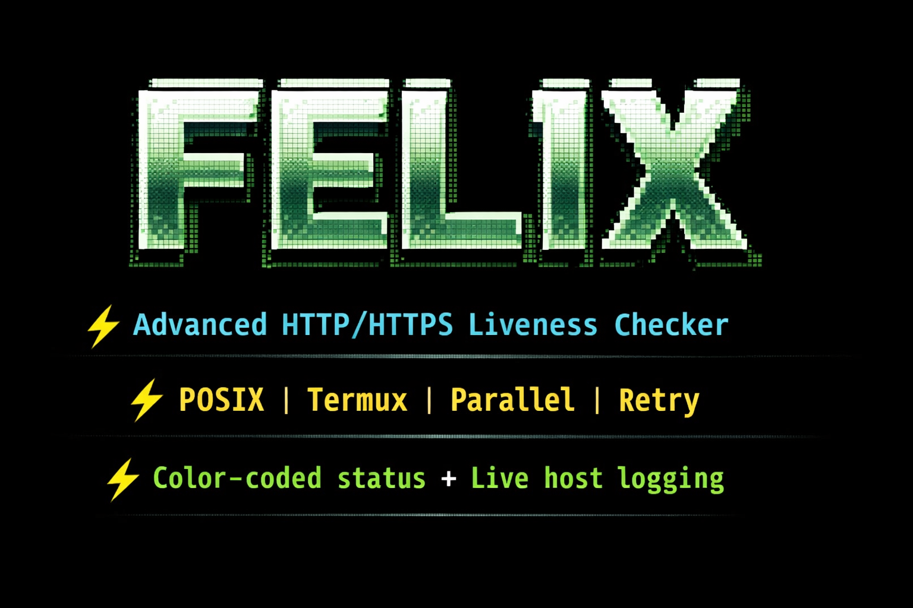

# Felix - Subdomain Liveness Checker

<p align="center">
  
</p>

Felix is a robust, POSIX-compliant HTTP/HTTPS liveness checker designed for security professionals and bug bounty hunters. It performs automatic protocol fallback, provides color-coded status output, and includes enterprise-grade features for subdomain reconnaissance.

## ✨ Features

✅ Dual Protocol Checking: Automatically tries HTTPS first, falls back to HTTP

🎨 Color-Coded Output: Instant visual feedback (Green: 2xx, Yellow: 3xx, Red: 4xx/5xx)

📁 Flexible Input: Accepts single subdomains or files

⚡ Performance Controls: Adjustable timeouts and rate limiting

🎯 Status Filtering: Filter results by specific HTTP status codes

💾 Smart Output: Save results with timestamps, optionally only live URLs

🔒 POSIX Compliant: Runs on any Unix shell (bash, sh, zsh, dash) including Termux

🛡️ Error Handling: Robust handling of edge cases and invalid input

📊 Timestamp Logging: All outputs include scan timestamps

🔄 Redirect Following: Automatically follows HTTP redirects

### 🚀 Quick Start

Installation

```bash
# Clone the repository
git clone https://github.com/exploitarium/felix.git
cd felix

# Run setup script
chmod +x scripts/setup.sh
./scripts/setup.sh
```

### Basic Usage

```bash
# Check a single subdomain
felix example.com

# Check from a file
felix -f subdomains.txt

# Check with custom timeout and output
felix -f subdomains.txt -t 5 -o results.txt
```

## 📖 Detailed Usage

### Command Line Options

Option Short Description Default

--file -f Input file containing subdomains 

--out -o Output file to save results 

--code -c Filter by status codes (comma-separated) 

--timeout -t Connection timeout in seconds 10

--rate -r Delay between requests in seconds 0

--live-only -l Save only live (2xx) URLs false

--verbose -v Show verbose output false

--help -h Show help message 

--version -V Show version 

Examples

Basic scan with file input:

```bash
felix -f subdomains.txt
```

Filter by specific status codes:

```bash
felix -f subdomains.txt -c 200,301,302
```

Save only live subdomains:

```bash
felix -f subdomains.txt -l -o live_subdomains.txt
```

Control request rate:

```bash
felix -f subdomains.txt -r 0.5  # 0.5 second delay between requests
```

Aggressive scanning (fast, shorter timeout):

```bash
felix -f subdomains.txt -t 3 -r 0.1
```

Comprehensive scan with all options:

```bash
felix -f subdomains.txt \
  -o scan_results.txt \
  -c 200,301,302,403 \
  -t 5 \
  -r 0.3 \
  -l \
  -v
```

Read from stdin (pipe input):

```bash
echo "example.com" | xargs felix
cat subdomains.txt | xargs -I {} felix {}
```

 Input File Format

Create a text file with one subdomain per line:

```txt
# subdomains.txt - Example file for Felix
# Comments start with #
# Empty lines are ignored

example.com
test.example.com
admin.example.com
api.example.com
mail.example.com
staging.example.com
dev.example.com
blog.example.com
shop.example.com
app.example.com

# You can also include protocol (it will be stripped)
https://secure.example.com
http://legacy.example.com
```

Lines starting with # are treated as comments and ignored. Felix automatically removes http:// or https:// prefixes if present.

### Output Examples

Terminal Output

```
 ███████╗███████╗██╗     ██╗██╗  ██╗
 ██╔════╝██╔════╝██║     ██║╚██╗██╔╝
 █████╗  █████╗  ██║     ██║ ╚███╔╝ 
 ██╔══╝  ██╔══╝  ██║     ██║ ██╔██╗ 
 ██║     ███████╗███████╗██║██╔╝ ██╗
 ╚═╝     ╚══════╝╚══════╝╚═╝╚═╝  ╚═╝
  Subdomain Liveness Checker v1.0.0

[*] Processing 5 subdomains from: subdomains.txt
[*] Timeout: 10s | Delay: 0s
[*] Output file: results.txt

[✓] https://example.com (200) - OK
[↪] https://test.example.com (301) - Moved Permanently
[✗] http://admin.example.com (404) - Not Found
[✓] https://api.example.com (200) - OK
[✗] https://mail.example.com (503) - Service Unavailable

[*] Scan completed
[*] Results saved to: results.txt (5 entries)
```

Output File Format

```txt
# Felix Scan Results - 2024-01-15 14:30:22
# Generated by Felix v1.0.0

https://example.com [200]
https://test.example.com [301]
http://admin.example.com [404]
https://api.example.com [200]
https://mail.example.com [503]
```

Status Code Colors & Meanings

 🟢 Green (2xx): Success - Server processed request successfully
 
  · 200 OK - Request succeeded
  
  · 201 Created - Resource created
  
  · 204 No Content - Success but no content
  
🟡 Yellow (3xx): Redirection - Further action needed

  · 301 Moved Permanently - Permanent redirect
  
  · 302 Found - Temporary redirect
  
  · 304 Not Modified - Cached version valid
  
🔴 Red (4xx/5xx): Client/Server Error

  · 400 Bad Request - Malformed request
  
  · 401 Unauthorized - Authentication required
  
  · 403 Forbidden - Access denied
  
  · 404 Not Found - Resource doesn't exist
  
  · 500 Internal Server Error - Server problem
  
  · 503 Service Unavailable - Server overloaded

## Advanced Usage

Integration with Other Tools

Combine with subdomain enumeration tools:

```bash
# Use with subfinder
subfinder -d example.com -silent | tee subdomains.txt | felix -f -

# Use with assetfinder
assetfinder --subs-only example.com | felix -f - -l -o live.txt

# Use with amass
amass enum -passive -d example.com | felix -f - -t 3 -r 0.2

# Use with findomain
findomain -t example.com -q | felix -f - -o results.txt
```

Process results with other commands:

```bash
# Extract only URLs
grep -E '^https?://' results.txt | cut -d' ' -f1

# Count by status code
grep -o '\[[0-9]*\]' results.txt | sort | uniq -c

# Filter 200 OK only
felix -f subdomains.txt -c 200 -o only_200.txt

# Get unique domains from results
cut -d' ' -f1 results.txt | sed 's#https\?://##' | cut -d'[' -f1 | sort -u
```

Batch processing multiple domains:

```bash
# Process multiple domain lists
for domain in $(cat domains.txt); do
    echo "[*] Processing $domain"
    subfinder -d $domain -silent | felix -f - -o "${domain}_live.txt"
done
```

### Termux Usage (Android)

Felix works perfectly on Android Termux:

```bash
# Install dependencies
pkg update && pkg install curl

# Make scripts executable
chmod +x felix.sh scripts/*.sh

# Run setup
./scripts/setup.sh

# Use Felix
felix -f subdomains.txt

# Or directly
./felix.sh example.com
```

### Technical Details

Protocol Fallback Mechanism

1. Attempts HTTPS connection first (port 443)
   
2. If HTTPS fails (timeout/connection error/SSL issue), falls back to HTTP (port 80)
   
3. Reports the first successful protocol
  
4. Follows redirects up to 10 hops (curl default)

Error Handling & Edge Cases

 ✅ Empty lines: Automatically skipped
 
 ✅ Comments: Lines starting with # ignored
 
 ✅ Invalid domains: Graceful failure with error message
 
 ✅ Network timeouts: Configurable timeout with fallback
 
 ✅ File validation: Checks file existence and permissions
 
 ✅ Malformed URLs: Strips protocols and normalizes input
 
 ✅ Rate limiting: Prevents overwhelming target servers
 
 ✅ Connection refused: Handled with clear error messages

Performance Optimization

· Uses curl with configurable timeouts

· Implements intelligent rate limiting

· Follows redirects automatically (reduces manual checking)

· Minimal resource usage (single process, no heavy dependencies)

· Parallel-safe (can be run in multiple instances)

Security Considerations

· Rate limiting: Prevents accidental DoS attacks

· Timeout control: Prevents hanging on unresponsive hosts

· No recursion: Only checks provided subdomains (no spidering)

· Transparent: Clear logging of all actions

· Safe defaults: Conservative timeouts and delays


### Use Cases

Bug Bounty Hunting

```bash
# Quick recon of target scope
cat scope.txt | while read domain; do
    echo "[*] Scanning $domain"
    assetfinder $domain | felix -f - -l -o "${domain}_live.txt"
done
```

Penetration Testing

```bash
# Comprehensive scan with different status codes
felix -f subdomains.txt -c 200,301,302,403,500 -o all_status.txt

# Focus on interesting endpoints
felix -f subdomains.txt -c 403,401 -o auth_issues.txt
```

Continuous Monitoring

```bash
# Daily scan with timestamp
DATE=$(date +%Y%m%d)
felix -f assets.txt -o "scan_${DATE}.txt"

# Compare with previous scan
diff scan_20240114.txt scan_20240115.txt
```

Asset Discovery

```bash
# Combine with other recon tools
amass enum -passive -d example.com -o amass.txt
subfinder -d example.com -o subfinder.txt
cat amass.txt subfinder.txt | sort -u | felix -f - -l -o assets.txt
```

### Benchmarks

Subdomains Timeout Delay Approx. Time
100 10s 0s ~16 minutes
100 5s 0.1s ~1.5 minutes
1000 3s 0.05s ~1 minute
1000 10s 0.5s ~8.5 minutes

Times are estimates based on average response times

### Contributing

We welcome contributions! Here's how to help:

1. Fork the repository
   
2. Create a feature branch
   ```bash
   git checkout -b feature/amazing-feature
   ```
   
3. Make your changes
   
4. Test thoroughly
   ```bash
   # Test with various inputs
   ./felix.sh --help
   ./felix.sh example.com
   ./felix.sh -f subdomains.txt -t 1
   ```
   
5. Ensure POSIX compliance
   ```bash
   # Check with shellcheck
   shellcheck felix.sh
   ```
   
6. Submit a pull request

Development Guidelines

· Maintain POSIX shell compatibility (avoid bashisms)

· Add clear comments for complex logic

· Handle all edge cases

· Update documentation accordingly

· Test on multiple shells (sh, bash, dash, zsh)


### ❓ FAQ

Q: Why does Felix fall back to HTTP after HTTPS fails?

A:Some services only run on HTTP, especially internal or legacy systems. The fallback ensures maximum coverage.


Q: How does Felix handle redirects?

A:Felix follows redirects automatically using curl's -L flag and shows the final status code.


Q: Can Felix handle wildcard subdomains?

A:Felix checks only the subdomains you provide. You should use it with subdomain enumeration tools.


Q: Is Felix safe to run on production systems?

A:Yes, with appropriate rate limiting. Use -r flag to add delays between requests.


Q: Why POSIX compliance?

A:POSIX compliance ensures Felix runs anywhere - on old systems, embedded devices, Termux, and any Unix-like environment.


Q: Can I use Felix in scripts?

A:Absolutely! Felix returns clean exit codes and produces parseable output.


### Copyright (c) 2026 Exploit Lab 

Permission is hereby granted, free of charge, to any person obtaining a copy
of this software and associated documentation files(the "Software"), to deal
in the Software without restriction,including without limitation the rights
to use,copy, modify, merge, publish, distribute, sublicense, and/or sell
copies of the Software,and to permit persons to whom the Software is
furnished to do so,subject to the following conditions:

The above copyright notice and this permission notice shall be included in all
copies or substantial portions of the Software.

## Disclaimer

Important: This tool is intended for:

· Authorized security testing

· Educational purposes

· Research and learning

· Testing your own systems

Always obtain proper written authorization before testing any systems you do not own or have explicit permission to test. The developers are not responsible for any misuse or damage caused by this tool.

### Quick Troubleshooting:

1. "curl not found": Install curl: apt install curl or brew install curl
   
2. "Permission denied": Make script executable: chmod +x felix.sh
   
3. "File not found": Check file path and permissions
   
4. "No output": Check if subdomains are valid and network connectivity
   

### 🌟 Star History

If you find Felix useful, please consider giving it a star on GitHub! It helps others discover the tool.

---

<p align="center">
Made with ❤️ for the security community | Keep hunting responsibly
</p>

<p align="center">
<a href="https://github.com/exploitarium/felix/stargazers">⭐ Star on GitHub</a> | 
<a href="https://github.com/exploitarium/felix/issues">Report Bug</a> | 
<a href="https://github.com/exploitarium/felix/pulls">Submit PR</a>
</p>
